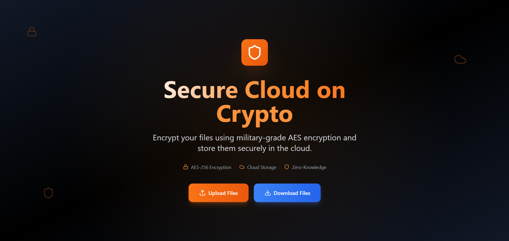
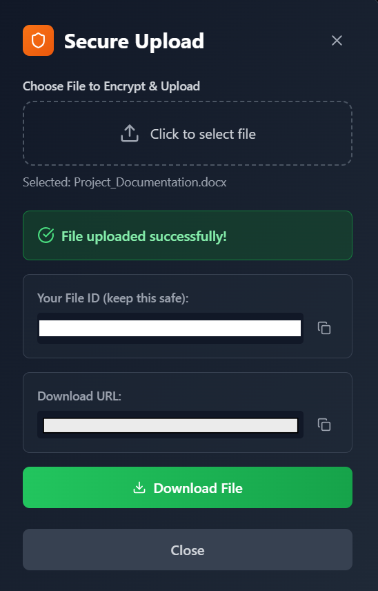
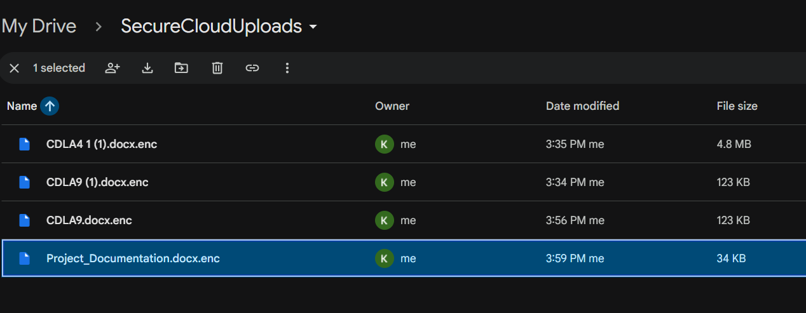
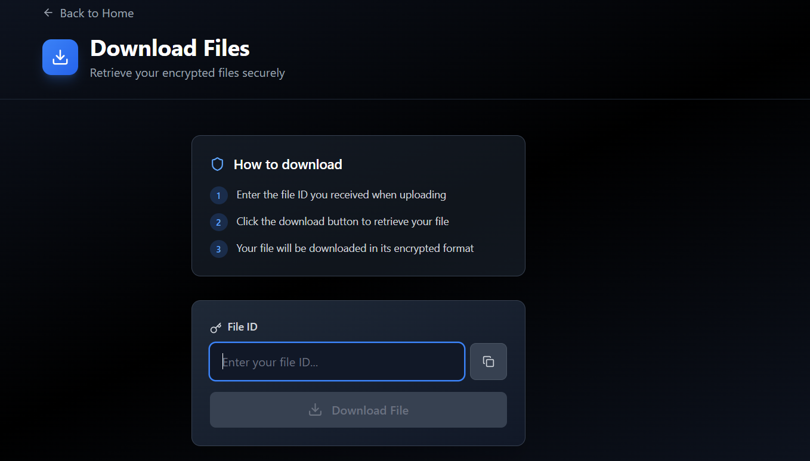

# 🔐 Secure Cloud 

> End-to-End Encrypted Cloud Storage using FastAPI, React, Express, and Google Drive

Encrypt files locally • Upload securely • Download safely • Store privately


---

# 📖 Overview

Secure Cloud 3.0 is an encrypted cloud storage platform built to ensure files remain protected before they ever leave the user’s device.

Files are encrypted using **AES-GCM encryption** and uploaded as encrypted data into **Google Drive**.

When downloading:

- Retrieve encrypted file
- Decrypt securely
- Restore original filename
- Restore original MIME type

Google Drive acts only as encrypted storage.

---

# ✨ Features

## 🔒 Encryption

- AES-GCM authenticated encryption
- 256-bit secure encryption
- Random nonce generation
- Integrity verification
- Secure file restoration

Metadata encrypted:

```text
filename || mime_type || file_data
```

No plaintext file information is exposed.

---

## ☁️ Cloud Storage

- Upload encrypted files
- Store in Google Drive
- Download and decrypt
- Preserve original structure

---

## 🔑 Authentication

- OAuth 2.0 Login
- No password storage
- Token reuse
- Automatic refresh

---

## ⚡ API Architecture

```text
Frontend (React)
       ↓
Express Proxy
       ↓
FastAPI Backend
       ↓
AES Encryption
       ↓
Google Drive
```

---

# 📸 Project Screenshots

## Home Page



---

## Secure Upload



---

## Google Drive Storage



---

## Download Page



---

# 🗂 Folder Structure

```text
secure-cloud-3.0/
│
├── backend/
│   ├── encryption/
│   │   ├── __init__.py
│   │   └── crypto.py
│   │
│   ├── models/
│   │
│   ├── storage/
│   │
│   ├── __init__.py
│   └── main.py
│
├── frontend/
│
├── server/
│   ├── index.js
│   └── package.json
│
├── assets/
│   ├── home.png
│   ├── upload.png
│   ├── drive.png
│   └── download.png
│
├── README.md
├── requirements.txt
├── vercel.json
└── .gitignore
```

---

# 🛠 Technology Stack

| Technology | Purpose |
|-----------|---------|
| React | Frontend |
| FastAPI | Backend |
| Express | Proxy |
| Python | Encryption |
| PyCryptodome | AES |
| Google Drive API | Storage |
| OAuth 2.0 | Authentication |

---

# 🚀 Installation

## Clone Repository

```bash
git clone https://github.com/kulin-m/Secure_Cloud_Storage.git

cd Secure_Cloud_Storage
```

---

## Install Backend

```bash
pip install -r requirements.txt
```

---

## Install Frontend

```bash
cd frontend

npm install
```

---

## Install Server

```bash
cd ../server

npm install
```

---

# 🔑 Environment Variables

Create:

```text
.env
```

Add:

```env
AES_KEY=your_aes_key
FOLDER_ID=your_drive_folder_id
```

---

# ▶ Run Application

Start backend:

```bash
uvicorn backend.main:app --reload
```

Start server:

```bash
node server/index.js
```

Start frontend:

```bash
npm run dev
```

---

# 🌐 Local URLs

| Service | URL |
|---------|-----|
| Frontend | http://localhost:5173 |
| Proxy | http://localhost:3000 |
| Backend | http://127.0.0.1:8000 |

---

# 🔐 Encryption Workflow

```text
Choose File
   ↓
Encrypt File
   ↓
Generate Ciphertext
   ↓
Upload to Drive
   ↓
Retrieve File
   ↓
Decrypt
   ↓
Download
```

---

# ⚠️ Security Notes

Never upload:

```text
credentials.json
cryptography-proj-*.json
token.pickle
.env
node_modules
server.log
```

Use `.gitignore`.

---

# 🛡 Limitations

- Single-user support
- No key rotation
- Local OAuth storage
- Flat cloud structure

---

# 🔮 Future Improvements

- Multi-user support
- AWS S3 integration
- File sharing
- Preview support
- Large file uploads
- Deployment pipeline

---

# 👥 Contributors

| Name | GitHub |
|------|--------|
| Kulin Mathur | [@kulin](https://github.com/kulin-m) |
| Ishant Shekhar | [@ishant212](https://github.com/ishant212) |
| Lakshya Kumar Singh | [@lakshya](https://github.com/X-ImLucky-X) |


---

---

### Secure • Encrypt • Store • Access
